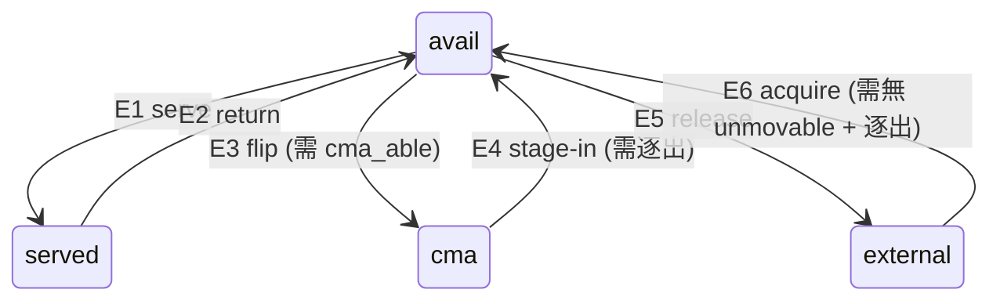

# 池子 v2 架構:狀態機、轉換、執行者

2026-08-07。目標是**功能幾乎不變**的重構——把已經存在的行為,
重新按「狀態機 + 邊 + 執行者」組織,讓不變式在程式碼裡看得見。

現況分析見 `POOL_STATE_MODEL.md`(五套結構、22 個手動同步點、`pool_total` 冗餘等)。
這份只寫**要變成什麼樣子**。

---

## 0. 目標與非目標

**目標**

- 四個狀態、六條邊,每條邊**恰好一個函式**負責「更新該更新的一切」
- 兩個不變式寫成程式碼,所有驅動邏輯從 deficit 出發
- 分類軸明確,新人能回答「這段該放哪」

**非目標**

- 不改回收機制(持有參照 + free hook 晚攔截)
- 不改 CMA 儲備池的物理操作
- 不追求行為完全等價——§8 列出**刻意的**行為差異,其餘一律不變

---

## 1. 狀態機

一個 2MB 頁在任一時刻恰好處於四個狀態之一。

| 狀態 | 意義 | 誰持有 |
|---|---|---|
| `served` | 借給 VM | VM(GUP pin)+ 我們一份保護參照 |
| `avail` | 在池子裡待命 | 只有我們 |
| `cma` | 在 CMA 儲備池,借給其他 app | 其他 app(可逐出) |
| `external` | 系統的 | 系統 |

**`cma_able` 是 `avail` 的屬性,不是狀態。** 它由**鄰域**決定:CMA 的 pageblock 可能
大於 2MB(`CMA_SUBBLKS = 1 << (pageblock_order - 9)`),整個 pageblock 的每個子塊
都在 `avail` 才算 `cma_able`。SUBBLKS==1 時恆為真。



`served → external` **不是一條邊**:它是 E2 之後 E5 立刻發生。
今天的程式碼就是這樣寫的(hook 先 `served_del`,`pool_want` 閘門立刻推出去),v2 維持。

### 1.1 不變式

```c
static int held_pool(void)  { return avail_count() + served_count; }      /* I1 左邊 */
static int held_total(void) { return held_pool() + cma_count(); }         /* I2 左邊 */

/* I1: held_pool()  == pool_want
 * I2: held_total() == pool_want_with_cma
 * Q : 最小化 avail_partial_count()(= avail 之中 !cma_able 的部分)  */
```

兩者都是**導出量**,沒有對應的儲存變數。

**`pool_total` 不刪**(原本說要刪,已收回——見 `POOL_STATE_MODEL.md` §3.2):
它是第三個量,是**帶遲滯的額度**,`refill_worker` 靠 `held_pool() < pool_total` 判斷欠債。
導出化會讓 refill 永遠不執行。要改的只有「`pool_do_resize` 拿它兼差當柵欄」那個 hack。

---

## 2. 分類軸:先按執行上下文,再按邊

這是這份設計的核心判斷。三個候選軸——按狀態、按邊、按執行上下文——
**按上下文分最有價值**,因為它切出的正是「寫錯會死機」的那條線:

> **六條邊裡只有兩條踩到 atomic 上下文,其餘四條都可以睡。**

| 邊 | 觸發 | 上下文 | 執行者 |
|---|---|---|---|
| E1 serve | 被動(VM 配置 order-9) | **atomic**(kretprobe、`raw_spin_lock_irqsave`) | serve hook |
| E2 return | 主動放參照 + 被動捕獲 | 放=可睡 / **捕獲=atomic**(`__free_one_page`,持 `zone->lock`、IRQ off) | release worker + free hook |
| E3 flip | 主動 | 可睡 | reconcile worker |
| E4 stage-in | 主動 | 可睡 | reconcile worker |
| E5 release | 主動 | 可睡 | reconcile worker |
| E6 acquire | 主動 | 可睡 | reconcile worker |

於是三層:

```
第 1 層  兩個 atomic 攔截點        只做 O(1) 的搬移,不配置、不睡
第 2 層  六個邊原語               每個負責「這條邊要更新的一切」
第 3 層  reconcile worker         從 deficit 驅動,決定要走哪條邊
```

**政策全部在第 3 層,機制全部在第 2 層,第 1 層只有反射動作。**
今天的問題正是這三層混在一起——`pool_take_frozen` 既是機制又含 `pool_want` 政策閘門。

---

## 3. 第 2 層:六個邊原語

```c
/* 每個函式負責:狀態結構、cma_able 索引、參照、統計 —— 全部。
 * 呼叫者不需要知道還要更新什麼。這是今天最大的隱性知識來源。 */

struct page *edge_serve(pid_t tgid);              /* E1  atomic-safe */
bool         edge_return(struct page *p);         /* E2  atomic-safe(捕獲半) */
int          edge_flip_to_cma(int nr);            /* E3  可睡 */
int          edge_stage_in(int nr);               /* E4  可睡 */
void         edge_release(struct page *p);        /* E5  可睡 */
struct page *edge_acquire(enum acquire_means m);  /* E6  可睡 */
```

### 3.1 E2 的三個出口收斂

今天 `served` 有三個出口、三種義務、沒有共用函式——**我踩過的 bug 就是這個**
(purge 移除了 entry 卻沒交還參照,那些頁再也不可能被 free)。v2:

```c
enum served_exit {
	SERVED_RETURNED,   /* 正常歸還:移除 entry,參照由 free hook 之後的流程處理 */
	SERVED_PURGED,     /* 放棄:移除 entry + 交還參照 */
	SERVED_UNLOAD,     /* 卸載:移除 entry + 交還參照 */
};
void served_remove(unsigned long pfn, enum served_exit reason);
```

**這是唯一一項「不做也會再出事」的改動,所以排第一。**

---

## 4. 資料結構:雙堆疊同時解掉兩件事

今天 `avail` 是單一 LIFO 陣列 `page_pool[]`,而 `cma_able` 的數量是另一個
增量維護的計數器 `pb_full_avail`。v2 把 `avail` 拆成兩個堆疊:

```c
static struct page *avail_partial[POOL_SIZE_MAX];  /* !cma_able:兄弟不齊 */
static struct page *avail_full[POOL_SIZE_MAX];     /*  cma_able:整個 pageblock 都是我們的 */
```

一次解決三個問題:

1. **serve 偏好**(語意:優先挑 `cma_able==false`)= 先 pop `avail_partial`,**維持 O(1)**。
   今天是純 LIFO,這條語意根本沒實作。
2. **`cma_able` 數量不再需要獨立計數器**:就是 `avail_full` 的長度。`pb_full_avail` 刪除。
3. **SUBBLKS==1 時 `avail_partial` 恆空**,整條路退化成今天的單堆疊,零成本。

### 4.1 代價:成員身分會因兄弟而變

服務掉 X 的兄弟 Y,會讓 X 從 full 掉到 partial。所以 push/pop 時要判斷歸屬,
而判斷要查兄弟——這正是 `pb_*` 索引存在的理由。

**張力必須講明**:`POOL_STATE_MODEL.md` §3.1 建議索引改成 rebuild-on-demand,
理由是「5 個讀取點都不在熱路徑」。**加上 serve 偏好之後這個前提就不成立了**——
E1 在 atomic 上下文要知道歸屬。

**解法**:索引仍然增量維護,但**只在一個地方**——`pb_track()` 今天已經算出
full↔partial 的轉換點(`pb_full_avail++/--` 那段),v2 讓它直接做**堆疊搬移**,
而不是更新一個平行的計數器。同步點從 22 個(散在四檔)收斂成 6 個邊原語內部。

---

## 5. 第 3 層:reconcile 是一張步驟表

今天 acquire 的階段順序寫死在 `acquire_worker()` 的控制流裡,
mode 1 少跑 Phase R 這件事只存在於註解(見 §8.2)。v2 讓順序變成**資料**:

```c
enum step_goal { GOAL_POOL, GOAL_TOTAL, GOAL_QUALITY };
enum step_cost { COST_FREE, COST_CHEAP, COST_EXPENSIVE };

struct reconcile_step {
	const char     *name;
	enum step_goal  goal;      /* 這步在服務哪個不變式 */
	enum step_cost  cost;
	bool          (*run)(void);/* true = 有進展 */
	bool            needs_cma; /* 沒有 CMA 能力就跳過,而不是整條路徑消失 */
};

static const struct reconcile_step steps[] = {
  { "stage-in (total met)", GOAL_POOL,    COST_CHEAP,     step_stage_in_if_total_met, true  },
  { "pair fill",            GOAL_QUALITY, COST_CHEAP,     step_pair_fill,             true  },
  { "drop slab",            GOAL_POOL,    COST_CHEAP,     step_drop_slab,             false },
  { "harvest free",         GOAL_POOL,    COST_FREE,      step_harvest_free,          false },
  { "stage-in",             GOAL_POOL,    COST_CHEAP,     step_stage_in,              true  },
  { "sweep",                GOAL_POOL,    COST_EXPENSIVE, step_sweep,                 false },
  { "reservoir fill",       GOAL_TOTAL,   COST_EXPENSIVE, step_reservoir_fill,        true  },
  { "quality",              GOAL_QUALITY, COST_CHEAP,     step_quality,               true  },
};
```

驅動就是一個迴圈:每步先問「我的 goal 還有 deficit 嗎」,有才跑。

**這個順序與今天完全相同**(Phase S → 1.5 → 0 → 1 → S2 → 2 → R → Q),
所以功能不變;差別是順序看得見、可審、可測。

### 5.1 acquire 的「版本」只換一步

`step_sweep` 依 `acquire_mode` 選手段——**其餘七步不受影響**:

| mode | 手段 | 需要的 symbol |
|---|---|---|
| 1 | `alloc_contig_pages` 盲掃 | `alloc_contig_pages` + `prep_compound_page` |
| 2 | sweep + 系統級 reclaim(A) | `alloc_contig_range` + `prep_compound_page`(+可選 `try_to_free_mem_cgroup_pages`、`mem_cgroup_from_task`) |
| 3 | sweep + 逐塊 evict(B) | 上列 + `folio_isolate_lru` + `reclaim_pages` |

這正是「數字越大越激進、依賴 symbol 越多」的規格,而且 v2 讓它**在結構上成立**
——今天 mode 1 走的是另一條函式,所以順手掉了 Phase R(§8.2)。

---

## 6. 觸發點 → worker:五個 work 收成兩個

今天有五個:`refill_work`、`pcp_drain_work`、`reclaim_release_work`、
`acquire_work`、`vm_owner_sweep_work`,彼此的取消順序有隱性依賴
(exit 路徑那段註解就是在交代這個)。

v2 兩個,分野是**延遲要求**:

| worker | 職責 | 觸發 | 特性 |
|---|---|---|---|
| `release_worker` | E2 的放參照掃描 | unshare kprobe、VM destroy kprobe | **要快**;退避重試;不可被 reconcile 擋住 |
| `reconcile_worker` | §5 的步驟表 | sysfs 寫入、release 完成後、VM destroy | 可長跑數分鐘;可取消 |

`vm_owner_sweep` 併入 reconcile 的一步;`pcp_drain` 併入 fallback 那一步。

**取消順序的隱性依賴一併消失**:只有兩個 work,且 release 不排 reconcile 以外的東西。

---

## 7. 檔案分割

| 檔案 | 內容 | 現況 |
|---|---|---|
| `gh_state.c.inc` | 四狀態的結構、六個邊原語、不變式 | 新增(從 gh_data 抽出) |
| `gh_hooks.c.inc` | **只有兩個 atomic 攔截點** + 它們的 kprobe 註冊 | 瘦身 |
| `gh_reconcile.c.inc` | 步驟表 + 兩個 worker + acquire 手段 | 新增(從 gh_cma 抽出政策) |
| `gh_cma.c.inc` | CMA 儲備池的**物理操作**,不含政策 | 瘦身 |
| `gh_subblk.c.inc` | SUBBLKS>1 的 cma_able 機構(756 行) | 集中;SUBBLKS==1 可整檔編掉 |
| `gh_sysfs.c.inc` | 旋鈕 | 大致不變 |

分割規則一句話:**能睡的和不能睡的分開,機制和政策分開。**

---

## 8. 刻意的行為差異(其餘一律不變)

功能「幾乎」不變的那個「幾乎」在這裡。每一項都要單獨驗。

### 8.1 serve 偏好(新增)
今天純 LIFO,v2 優先服務 `!cma_able`。**效果**:cma_able 的頁被保留給 E3,
`avail_partial` 先被消耗。SUBBLKS==1 無差異。

### 8.2 mode 1 是否補上 reservoir fill(**待你決定**)
今天 `acquire_worker_v1()` 只跑 pool 迴圈,**Phase R 完全不執行**——
在 mode 1 下儲備池永遠不會被填。這不是「手段不同」,是少一整條語意。
v2 的步驟表結構上會讓 mode 1 也跑到 `reservoir fill`。
**兩個選項**:(a) 照規格補上;(b) 維持現況,但寫成 `needs_cma` 之外的顯式條件,
而不是「因為走了另一個函式所以順手沒跑」。

### 8.3 暫存塊的歸還時機(**待你決定**)
你的規格是「acquire 完成後歸還」;今天是**老化 `LIMBO_MAX_AGE = 3` 個 pass 後**才放,
可以跨 acquire 存活。改成結束即歸還**更嚴格也更好推理**(不累積、不污染下一輪判斷)。

### 8.4 暫存容量
你寫「最多 8 塊」;今天 `LIMBO_MAX = 64`,`cma_phase_q` 的 8 是**輪數**,
`cma_pair_fill` 的 budget 是 **256 子塊**。三個數字要統一成規格。

### 8.5 `pair_fill` 的執行條件(**規格與現況相反**)
你寫「前兩個滿足後」才做;今天 `cma_pair_fill()` **只在 pool 還短時跑**
(`>= pool_want` 就 break)。`cma_phase_q` 的條件則與你一致。
我認為現況合理——配對本來就是「順便挑更好的位置抓」,在補 pool 的過程中做才有意義;
但要照規格改也可以,請明示。

---

## 8.6c 【2026-08-08 實測】排序讓鬆弛額度接近多餘

在 `sim_pb_order=10`(SUBBLKS=2)下跑 VM 週期,**借出 2049 頁,殘缺塊始終只有 1–2 個**:

```
起始      avail=3072  cma_able=3070   不可轉換 2
VM 執行中 avail=1023  cma_able=1022   不可轉換 1
VM 關閉後 avail=3072  cma_able=3070   不可轉換 2
```

若 serve 隨機挑、或只做兩區分割而不按 pfn 排序,2049 次借出會留下**數百個**各缺一半的塊。
維持 1–2 表示 serve **一次吃掉一整塊**——雙鍵排序第二個鍵(同塊 pfn 相鄰)的作用,
這段程式碼在此之前從未執行過。**雙鍵排序驗證通過。**

**連帶結論:鬆弛額度在此負載下接近多餘**,因為它要解的問題被排序從源頭消掉了。
剩下的 2 個殘缺塊是兄弟已在 CMA 儲備池裡(`cma_pb_mt(w) == migrate_cma_val` → 絕不穿過
CMA 標籤搶),永遠湊不回來,所以 `quality converged` 是正確答案不是失敗。

**仍未驗證**:鬆弛額度放行抓取的路徑(`in_user` 始終為 0)。它是「寫好、編過、未執行」,
不可宣稱已驗證。要觸發需要「我們持有部分子塊、缺的子塊是自由外部記憶體」的情境,
在 SUBBLKS=2 + 有效排序下很難自然產生;SUBBLKS=4 或別的負載可能不同。

---

## 8.6b 實作面測繪(2026-08-08):範圍與一個不是純簿記的函式

limbo 觸及 **5 個檔案、約 100 行、57 處直接引用**:

```
gh_cma.c.inc     48    gh_data.c.inc  28    gh_hooks.c.inc 18
gh_hugepage_reserve.c 4     gh_sysfs.c.inc  2
```

要刪的:`limbo_pages[]`/`limbo_age[]`/`limbo_lock`、`PB_LIMBO` 位元、
`limbo_add`/`limbo_del_idx`/`limbo_age_bump`/`limbo_add_rebuild_order9`、
`cma_limbo_exchange`/`cma_limbo_intake_cap`、以及 `pool_take_frozen_exchange`
(free hook 那條,見 §8.6 的討論——可直接刪,不需要以鬆弛取代)。

**一個要小心的**:`cma_limbo_process()` **不是純簿記**。除了處理孤兒老化,
它還負責「兄弟湊齊時把整塊 commit 進儲備池」。刪掉 limbo 時**那段邏輯必須有去處**,
不能跟著一起消失。這是這項工作裡唯一不是機械式刪除的部分,
也是為什麼它該當成一次完整的 pass 做,而不是分次刪。

**做這件事的前置都已備妥**:`cma_flip_commit()` 是唯一的 avail→cma 機制(`069a84c`)、
雙鍵排序讓 `cma_able` 在底端連續(`e965678`)、`in_*` 計數器能分辨頁的來源(`5ff218a`)。

---

## 8.5b 【擋路石】3b 必須排在 §8.6 之後

3b 的目標是消掉 `ext→cma` 直達邊,讓 acquire 改成組合 `ext→avail` + `avail→cma`。
**但組合會讓儲備池的頁經過 avail,而 avail 成長正是抬高 `pool_total` 的觸發條件**
(`pool_push_grow()`:`if (idx + 1 > pool_total) WRITE_ONCE(pool_total, idx + 1);`)。

`pool_total` 是**背景補充的安全天花板**(見 `POOL_STATE_MODEL.md` §3.2 與
[[pool-want-vs-pool-total-risk]])。被儲備池的量抬高之後,`refill_worker` 會認為
「持有這麼多已被證明安全」,然後在背景自己補到那個量——**那正是它存在要防的事**。

**所以順序是 §8.6 先、3b 後**:要先有「暫存/過境的頁不計入額度」的帳,
組合才不會污染風險模型。可行的兩條路:

1. 一條**不抬高 `pool_total`** 的過境 push(`pool_push_transient()`),或
2. §8.6 的鬆弛額度正式化,`pool_total` 的推進明確排除鬆弛區。

我傾向 2:鬆弛本來就要記帳,多一條 push 路徑只是把問題換個地方藏。

已完成的前置(不受此擋):`cma_flip_avail_page()` 已抽出(`0dca52b`),
雙鍵排序讓 `cma_able` 在底端連續(`e965678`)。
另有第三份 avail→cma 實作 `cma_block_commit()`(singles-held 路徑)待一併合併。

---

## 8.6 暫存塊併入 avail,用鬆弛額度取代 limbo(**設計已定,未實作**)

limbo 存在的唯一原因是**容量約束**:要湊滿一個 CMA block,得先把某頁移出 avail 騰位子,
被移出的那頁無處可去 → 發明第三個桶。**給鬆弛額度就不必移出**,limbo 整個消失。

```
掃描期間:  held_pool()  <= pool_want            + SLACK
           held_total() <= pool_want_with_cma   + SLACK
結束時  :  cma→avail,再 avail→external,把多餘的還掉
```

一併消失的:`limbo_pages[64]`、`limbo_age[]`、`limbo_lock`、`PB_LIMBO` 位元、
`cma_limbo_exchange`、`cma_limbo_process`、`limbo_age_bump`、`cma_limbo_intake_cap`,
以及 `LIMBO_MAX_AGE=3` 這個猜測性的老化啟發式——**改用確定性的「結束時清掉多餘」**。
收尾寫成 `cma→avail` + `avail→external` 兩步,沒有 `cma→external` 直達,與 §3b 同一個原則。

### 四個必須做對的地方

1. **收尾不能掛在 acquire 的離開路徑上**(這條 2026-08-08 修正,原本寫錯)。
   limbo 今天有**兩個**餵食者,只有一個在 acquire 裡:

   | 餵食者 | 上下文 | 情境 |
   |---|---|---|
   | `cma_limbo_exchange()` | acquire worker | 湊 block 要騰位子 |
   | **`pool_take_frozen_exchange()`** | **free hook(atomic)** | `pool_want` 中途調小,回流的頁被閘門拒收,但兄弟還被守著 |

   第二個是**歸還路徑**,隨時可能發生,跟 acquire 有沒有在跑無關——
   所以**根本沒有「acquire 結束」可以掛**。收尾必須是與 acquire 解耦的獨立觸發
   (掛在 reconcile/release worker),條件是「目前超額且採集靜止」。
   今天 limbo 的老化之所以能當安全網,正是因為它也與 acquire 解耦。

   連帶兩條變嚴:**free hook 在 atomic 上下文**,那裡的鬆弛只能是
   「查一個計數器然後收下」,不能配置、不能掃描;而 **SLACK 的用量有兩個來源**
   (湊 block 的暫存 + resize 中途回流的頁),不能只按前者估。
2. **鬆弛期間 deficit 會是負的**。`held_pool() > pool_want` 暫時合法,
   所以讀 deficit 的地方都要能吃負值。建議在命名上分開:`pool_deficit()` 與 `pool_overshoot()`。
3. **SLACK 不該是常數 256**(=512MB,而 acquire 正是系統最緊的時候)。
   湊滿一個 block 最多需要 `SUBBLKS-1` 個兄弟,所以實際需求 =
   **同時在湊的 block 數 × (SUBBLKS-1)**,應該由此導出。
4. **暫存頁會被 serve 優先吃掉**:暫存按定義是 `!cma_able`,而 serve 偏好正好優先挑 `!cma_able`。
   這是對的(VM 的需求勝過品質優化),但代表 VM 活躍時湊 block 幾乎不會成功。
   是行為不是 bug,但要先知道。

---

## 9. 遷移順序

每一步都要能單獨部署與回退。**不做大爆炸式重寫。**

| # | 步驟 | 風險 | 為什麼這個順序 |
|---|---|---|---|
| 1 | `served_remove(pfn, reason)` 收斂三個出口 | 低 | 唯一「不做會再出事」的 |
| 2 | 不變式四函式(純新增),呼叫端逐步搬 | 低 | 後面每一步都要用 |
| 3 | resize 柵欄改顯式旗標(**不刪** `pool_total`,見 §3.2 收回) | 低 | 依賴 2 |
| 4 | `avail` 拆雙堆疊 + serve 偏好 | 中 | 一併消掉 `pb_full_avail` |
| 5 | 六個邊原語,同步點收進去 | 中高 | 依賴 4 |
| 6 | 步驟表 + 兩個 worker | 中高 | 依賴 5;§8.2 在這裡定案 |
| 7 | 檔案分割 | 低(純搬移) | 最後做,避免搬到一半又改內容 |

**驗證**:每步都跑 `POOL_RECLAIM_PLAN.md` 的那組——boot → grow → shrink → stop,
`fallback_sweep=0`,看 `del_hit == released_idle`、`deficit` 歸零、兜底 0 次。
步驟 4 之後要另外驗 serve 偏好(SUBBLKS==1 上看不出來,需要人造 SUBBLKS>1 的環境)。

### 不要動的部分

- free hook 在 `__free_one_page` **晚攔截**:頁必須走完 `free_pages_prepare`
- **借出時持有參照**:這是 100% 回收的機制本身
- 配置側 kretprobe:發頁的必要手段,沒有替代品
