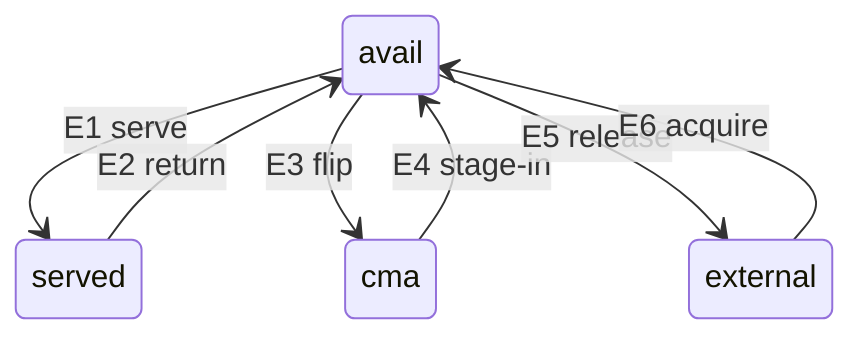

# 綠地設計:大頁監護模組

2026-08-07。**當作新專案**設計,不含遷移路徑(那是 `POOL_ARCH_V2.md`)。

一句話定義這個模組在做什麼:

> 從系統手上取得 2MB 連續頁的**監護權**,在「借給 VM」「留著待命」「借給其他 app」
> 「還給系統」四種處置之間搬移,並保證每一頁都能回得來。

---

## 0. 分解:你的三塊,加上我認為缺的五塊

你提的分解是對的,但**只涵蓋了「順利時」的路徑**。缺的幾塊都是「不順利時」與
「怎麼知道發生了什麼」——而這類模組出事的代價是手機重開,所以它們不是輔助,是核心。

| | 區塊 | 來源 |
|---|---|---|
| C1 | 狀態機定義 | 你 |
| C2 | 狀態轉換 | 你 |
| C3 | 能力對應:每條邊需要哪些 kernel 能力與呼叫 | 你 |
| **C4** | **事件偵測(inbound)**:我們怎麼**知道**外界發生了什麼 | 補 |
| **C5** | **歸屬**:`served` 是**誰的** | 補 |
| **C6** | **併發與上下文契約**:哪裡能睡、哪裡不能 | 補 |
| **C7** | **生命週期**:建池 → ready → 卸載,各階段規則不同 | 補 |
| **C8** | **可觀測性**:在這種模組裡是產品的一部分,不是裝飾 | 補 |
| A1 | 解除廠商「CMA 限制遷入」 | 你 |
| A2 | 猜測式救援(碎片化後的補救) | 補 |

**C3 vs C4 是兩件事**:C3 是我們**打出去**的呼叫(`alloc_contig_range`、`reclaim_pages`),
C4 是我們**接收**的事件(VM 建立/銷毀、記憶體歸還、頁被釋放)。
兩者的可攜性痛點完全不同——C3 缺符號就是能力降級,C4 缺符號是**整條語意消失且悄無聲息**。

---

## C1. 狀態機定義

四個狀態,一頁在任一時刻恰好處於其一:

| 狀態 | 意義 | 誰持有 | 可否被系統回收 |
|---|---|---|---|
| `served` | 借給 VM | VM 的 GUP pin + 我們的保護參照 | 否 |
| `avail` | 池中待命 | 只有我們 | 否 |
| `cma` | CMA 儲備池,借給其他 app | 其他 app | **是(可逐出)** |
| `external` | 系統的 | 系統 | — |

**`cma_able` 是 `avail` 的屬性,不是第五個狀態。** 它由**鄰域**決定:
CMA 的 pageblock 可能大於 2MB,整個 pageblock 的每個 2MB 子塊都在 `avail` 才算數。

### 不變式

```
I1  served + avail            == pool_want
I2  served + avail + cma      == pool_want_total
Q   最小化 avail 之中 !cma_able 的數量
```

三個都是**導出量**。不設對應的儲存變數——同一個事實存兩份,遲早會分歧。

---

## C2. 轉換



`avail` 是樞紐:只有它能直達其他三個。`served → external` **不是一條邊**,
是 E2 之後 E5 立刻發生(歸還時發現 `pool_want` 已調低)。

| 邊 | 前置條件 | 失效時的行為(**必須指定**) |
|---|---|---|
| E1 | 有 `avail`;能記錄歸屬 | 記錄不下 → **拒絕服務**(寧可池子短,不可有追蹤不到的借出) |
| E2 | 借用方已完全放手 | 尚未閒置 → 保持 `served`,下輪再看 |
| E3 | `cma_able` | 否 → 跳過該頁 |
| E4 | 逐出借用者成功 | 失敗 → 該塊留在 `cma` |
| E5 | — | — |
| E6 | 整塊無 unmovable + 逐出成功 | 失敗 → 換一塊;連續失敗達門檻 → 放棄本輪 |

**設計原則:每條邊的失效行為都必須是「停在原狀態」,絕不能是「離開來源狀態但沒到達目標」。**
那是唯一會真正遺失頁的形狀。

### E1 的挑選策略

優先服務 `!cma_able`,把 `cma_able` 的頁留給 E3。
實作上把 `avail` 拆成 `avail_partial` / `avail_full` 兩個堆疊,pop partial 優先,**維持 O(1)**;
`cma_able` 的數量就是 `avail_full` 的長度,不需要另一個計數器。
SUBBLKS==1 時 `avail_partial` 恆空,整條路退化成單堆疊。

---

## C3. 能力對應:邊宣告需求,模組決定可用性

這是綠地設計最該重來的一塊。**「acquire mode 1/2/3」不該是使用者設定的整數**——
它們其實是 **E6 的三種實作,各有不同的能力需求**。模組應該自己挑能用的最好那個。

```c
struct kcap { const char *name; void **slot; };

struct edge_impl {
	const char        *name;
	enum edge          edge;
	int                rank;      /* 越大越有效,也越依賴 */
	const struct kcap *caps;      /* NULL 結尾;全部解得到才可用 */
	int              (*run)(...);
};
```

載入時:解析所有符號 → 算出每個實作可不可用 → **印出一張能力矩陣**。
不可用的實作被停用,reconciler 永遠不會選到它。缺能力 = **降級,不是崩潰**。

| 邊 | 實作 | 需要的能力 |
|---|---|---|
| E1 | 唯一 | 配置側攔截(C4)|
| E2 | 唯一 | 釋放側攔截(C4)+ `prep_compound_page` |
| E3/E4 | 唯一 | `set_pageblock_migratetype`、`get_pfnblock_flags_mask`、`alloc_contig_range_cma`、`alloc_contig_pages`、`prep_compound_page` |
| E5 | 唯一 | — |
| **E6** | **r1 盲掃** | `alloc_contig_pages` + `prep_compound_page` |
| | **r2 掃描 + 系統級 reclaim** | `alloc_contig_range` + `prep_compound_page`(+`try_to_free_mem_cgroup_pages`、`mem_cgroup_from_task` 加強) |
| | **r3 掃描 + 逐塊 evict** | 上列 + `folio_isolate_lru` + `reclaim_pages` |

**符號取得**:這些幾乎都沒有 EXPORT。合法途徑是 `register_kprobe` 取得
`kallsyms_lookup_name` 再解析其餘。這本身是一個子系統(解析、驗證、版本閘門),
要獨立成一塊,不要散在各處。

**關鍵設計約束**:能力矩陣**只在載入時算一次**,之後不變。
執行期依能力分支會讓行為隨機不可重現。

---

## C4. 事件偵測(inbound)

我們需要知道四件事,每件都沒有官方 API:

| 事件 | 手段 | 上下文 | 缺失時 |
|---|---|---|---|
| VM 要一個 order-9 頁 | 配置側 kretprobe | **atomic** | 整個模組無意義 |
| 一頁回到 buddy | 釋放側 vendor tracepoint | **atomic**(持 zone lock、IRQ off) | 回收完全失效 |
| VM 銷毀 | kprobe,符號名依核心而異 | 任意 | 歸還延遲到不確定時點 |
| VM 執行中歸還記憶體 | kprobe(reclaim 路徑) | 任意 | **shrink 變成關機才還** |

**符號名要用量的,不能用猜的。** 名字最像的未必在路徑上——
一個註冊成功、log 也印了「正在監看」、但實際從未觸發的 kprobe,是最糟的失效模式:
它看起來是好的。**每個偵測點都要有「我確實被觸發過」的計數器**(見 C8)。

C4 的所有 handler 只做兩件事:記一筆、排一個 worker。**不在 handler 裡做決策。**

---

## C5. 歸屬

`served` 需要知道「是誰的」,否則 VM 死亡時無法判斷哪些頁該回來。
以 `mm` 為鍵記錄持有者與計數;程序退出時 `mm_users` 掉到 0 就是訊號。

**注意 `do_exit` 的順序**:`exit_mm()` 早於 `exit_files()`,所以 fd 釋放時
`current->mm` 已是 NULL。歸屬判定不能只靠 `current`。

---

## C6. 併發與上下文契約

**六條邊裡只有兩條踩到 atomic 上下文**(E1、E2 的捕獲半)。這條線決定分層:

```
第 1 層  兩個 atomic 反射動作     O(1),不配置、不睡
第 2 層  六個邊原語               每個負責「這條邊要更新的一切」
第 3 層  reconciler               從 deficit 驅動,決定走哪條邊
```

**政策全在第 3 層,機制全在第 2 層,第 1 層只有反射。**

worker 只要兩個,分野是**延遲要求**:

- `release_worker` — E2 的掃描。要快;退避重試;不可被長跑的工作擋住。
- `reconcile_worker` — 步驟表。可跑數分鐘;可取消。

鎖的層級由狀態結構決定,而**不是**由呼叫路徑決定:`avail` 鎖 → `served` 鎖 → 索引鎖,
單向巢狀,文件寫死。

---

## C7. 生命週期

| 階段 | 規則 |
|---|---|
| 建池 | 只有 E6;不對外提供任何服務 |
| ready | 全部邊可用;A1 才允許啟用 |
| 收池 | E5/E3 為主 |
| 卸載 | **先卸攔截點,再停 worker,最後交還所有參照** |

卸載順序不是細節:反過來做就會有 worker 在攔截點已拆的情況下釋放參照,
而那條路徑正好沒有人負責刪除記錄。

**原則:模組卸載後,系統必須回到完全正常的狀態**——不能有任何一頁還被我們的參照抓著。

---

## C8. 可觀測性(這是產品的一部分)

這種模組的 bug 代價是手機重開機,而且症狀往往是「數字對不上」而非崩潰。
診斷要當成需求設計,不是事後加。

- **每個偵測點的觸發計數**:區分「沒發生」與「沒接到」
- **每條邊的成功/失敗/失敗原因計數**
- **兩個不變式的即時左右邊**,以及差額
- **外部探針**:一個獨立模組,能傾印每個 `served` entry 的頁面狀態
  (refcount、mapping、flags、是否 pinned)。**不要編進主模組**——
  為了看一眼狀態而卸載主模組,會把整個池子還給系統而且不保證拿得回來。

---

## A1. 解除廠商的「CMA 限制遷入」

### 為什麼需要

E3 產出 `cma` 狀態的頁,但**廠商核心不會把一般的 movable 配置放進 CMA**——
只有明確帶 `__GFP_CMA` 的請求(實務上是廠商自己的驅動)才進得去。
沒有這塊,儲備池會是「監護著、但沒人用得到」的狀態:**兩頭皆空**。

所以 A1 的定位是:**讓狀態機的產物真的能被消費。** 它不參與狀態機,
但沒有它,`cma` 這個狀態就沒有存在價值。

### 怎麼做

在配置路徑的 flags 調整點掛 vendor hook,對**單純的 MOVABLE 請求**
(page cache、mTHP anon)放寬 `ALLOC_CMA`。判定用公開的 `__GFP_*` 巨集組合
(`__GFP_MOVABLE` 設 且 `__GFP_RECLAIMABLE` 未設),
**不要**去讀未匯出的 `page_group_by_mobility_disabled`。

### 前置條件(缺一不可)

1. 開關已啟用
2. **儲備池已建好且採集靜止**——建池/prefill 期間或 acquire 執行中一律不放行,
   否則 app 的消費會跟採集者搶同一批空閒頁
3. 放行之後系統剩餘 CMA 仍高於水位

第 2 條是設計上最容易漏的:**借出與採集不能同時進行**,否則兩邊互相拆台。

### 這是 best-effort,而且沒有回報通道 —— 設計必須承認這件事

**沒有任何 API 能告訴我們:(a) 這個核心吃不吃這一招,(b) 掛上去之後有沒有生效。**
`ALLOC_CMA` 是 `mm/internal.h` 的 `#define`,不帶 BTF、preflight 驗不到;
它的位值在各 GKI 上結構性固定,但那是**觀察不是保證**。放寬之後也沒有回傳值可看——
配置成不成功由配置器決定,我們只是改了它的輸入。

所以 A1 **不能當成一個「功能」交付,只能當成一個賭注**:

- **獨立開關**,與狀態機完全解耦;關掉之後其餘一切照常運作
- **綁核心版本區間**,超出範圍直接不啟用
- **驗證由使用者做,不是由模組宣稱**。app 應該提示的流程是:
  開啟 CMA 功能 → 建立 CMA 塊 → 跑壓力測試 → **看 lent 數值有沒有上升**。
  上升就是有效,沒上升就是這台機器不吃,關掉即可。
- 模組**不要**印「已啟用」這類訊息假裝知道結果——它不知道。
  能報的只有「我掛上去了」,不是「它有用」。

這一節是整份設計裡唯一沒有內建可觀測性的部分(對照 C8),
而那不是疏漏,是因為**核心沒有提供**。把它寫明,比假裝有把握好。

---

## A2. 猜測式救援

E2 有一個前提:歸還的頁是**完整的 order-9**。持有參照讓這件事成立
(借出期間不可能被拆散),所以正常情況下不需要救援。

但保留一條「掃描已釋放窗口、重組 2MB」的補救路徑仍然有價值——
**不是因為需要它,而是因為它現在可證明是靜止的**。
它出手的次數就是「碎片化是否重新出現」的偵測器,拆掉就沒有了。

**必須預設可關閉,並且關掉之後不變式仍然成立**——這是驗證機制本身是否站得住的唯一方法。

---

## 附:與現況的差異

現況實作(6305 行)與這份設計的主要落差,見 `POOL_STATE_MODEL.md`。
最大的三項:

1. E1 沒有挑選策略(純 LIFO)
2. `pool_total` 是 I1 左邊的儲存版本,與導出值會分歧
3. E6 的三種實作是使用者設定的整數,而不是依能力自動挑選;
   其中 r1 還順手少跑了一整條語意(儲備池補充)
