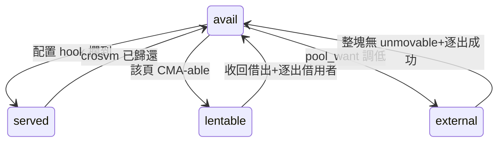

# 池子的狀態模型:現況對照與簡化建議

2026-08-07。這份文件把 `gh-hugepage-reserve` 的 6305 行對照到一個四狀態模型,
指出哪些地方對不上,以及**哪些對不上是維護成本的來源**。

沒有動任何程式碼。建議按風險排序,每一項都標了為什麼值得做與代價。

---

## 1. 模型

一個 2MB 頁在任一時刻恰好處於四個狀態之一:

| 狀態 | 意義 |
|---|---|
| `served` | 借給 VM 中 |
| `avail` | 在池子裡待命 |
| `lentable` | 已翻進 CMA 儲備池,借給其他 app 使用 |
| `external` | 不在我們的監護之下,屬於系統 |

`avail` 是樞紐:只有它能直接轉去其他三個,其他三個回來也都先落在它。



### 1.1 CMA-able 是屬性,不是狀態

`avail` 分成「可轉換 CMA」與「不可轉換」,但**這不是第五個狀態**——
一頁能不能翻進 CMA 取決於**它的鄰居**,不取決於它自己:
CMA 的 pageblock 可能比 2MB 大(`CMA_SUBBLKS = 1 << (pageblock_order - 9)`),
必須整個 pageblock 的每個 2MB 子塊都在我們手上,才能整塊翻過去。

所以它是一個**由鄰域導出的屬性**。這一點現有程式碼判斷是對的
(`cma_avail_cma_able_2mb()` 讀 `pb_full_avail`),問題只在**怎麼維護它**(見 §3.1)。

**本機 `pageblock_order_val = 9` == `PAGE_ORDER`,所以 `CMA_SUBBLKS == 1`,
每個 avail 頁自成一個完整 pageblock → 不可轉換量恆為 0。但別台機器不是**
(沒開 `CONFIG_HUGETLB_PAGE` 的核心 `pageblock_order = MAX_PAGE_ORDER = 10` → SUBBLKS=2),
所以這套機構必須留著,而且要留在設計裡而不是留在角落。

### 1.2 兩個目標 = 兩個不變式

1. `served + avail == pool_want`
2. `served + avail + lentable == pool_want_with_cma`
3. (品質)最小化 `avail` 之中不可轉換 CMA 的部分

現值:`0 + 3063` vs `3072`、`0 + 3063 + 1411` vs `4483`——兩式都差同樣那 9 頁
(GUP pin 延遲釋放,見 `POOL_RECLAIM_PLAN.md`)。**模型與現況吻合。**

---

## 2. 現況對照

### 2.1 狀態的表示 —— 五套結構

| 狀態 | 結構 | 位置 |
|---|---|---|
| `avail` | `page_pool[]` 陣列 + `pool_count` | gh_data |
| `served` | `served_nodes/served_bucket` pfn 雜湊 | gh_data |
| `lentable` | `cma_blocks_*` | gh_cma |
| (limbo) | `limbo_pages[64]` + `limbo_age[]` | gh_data |
| CMA-able 屬性 | `pb_nodes/pb_bucket` pageblock 雜湊 + `pb_full_avail` | gh_data |

### 2.2 轉換的實作

| 邊 | 前置條件 | 實作 | 觸發 |
|---|---|---|---|
| avail→served | — | `pool_serve()` = `pool_pop` + `served_add_locked` + `get_page` + `pb_track` | 配置 kretprobe(被動) |
| served→avail | refcount==1 && !mapping | `served_release_idle()` → `put_page` → free hook → `served_del` + `pool_take_frozen`(+`rebuild_order9_compound` + `pb_track`) | sweep(reclaim kprobe/destroy worker/reconcile)+ free tracepoint |
| avail→lentable | 該頁 CMA-able | `pool_do_resize()` flip → `cma_stage_in`/`cma_commit_compound_block`/`cma_sweep_window_to_reservoir` | 寫 `pool_want_with_cma` |
| lentable→avail | 逐出借用者 | `cma_reservoir_demolish`/`cma_block_demolish`/`pool_extract_block` | 調低 `pool_want_with_cma` |
| avail→external | — | `pool_do_resize()` 的 drain | 調低 `pool_want` |
| external→avail | 整塊無 unmovable + 逐出成功 | `acquire_worker`→`acquire_sweep`→`block_candidate`→`reclaim_block_b`/`reclaim_system_a`→`acquire_grab_free` | 寫 `acquire`(手動) |
| served→external | `pool_want` 已降低 | free hook 的 gate 拒收(`gate_drop`) | 被動 |

最後一條在模型裡其實是 **served→avail→external 兩步被融合**:
hook 先 `served_del`(回到 avail 的語意),`pool_want` 的閘門立刻把它推出去。
程式碼已經是這樣寫的,不需要新增狀態。

---

## 3. 對不上的地方(維護成本在這裡)

### 3.1 【最大一筆】CMA-able 索引既增量維護、又能整份重建

`pb_*` 雜湊是一個**導出索引**:它的內容完全由 `page_pool[]` + served 表 + limbo 決定。
但它同時有兩套維護方式:

- **增量**:`pb_track()` 有 **22 個呼叫點**,散在四個檔案,每條狀態轉換都要手動同步。
  代價還包括 `pb_lock` 與「pool_lock → pb_lock」的巢狀鎖紀律。
- **整份重建**:`pb_rebuild()` 已經存在(51 行),從 `page_pool[]` 掃一遍就重建完整索引,
  而且**只有 1 個呼叫者**——它已經被當成偶發修補在用。

**讀寫比是反的**:22 個寫入點服務 **5 個讀取點**
(`refill_stat`、`pool_avail_cma_able` 兩個 sysfs、`cma_limbo_intake_cap` 的上限計算、
limbo 處理的條件、acquire sweep 的一個決策)——**沒有一個在熱路徑上**。

**分歧會發生,而且已經在讀取端被補**:`gh_sysfs.c.inc:356` 的 `/* stale bit */` 實情是
`pb_find_class_c_avail()` 交回一個 pfn、`pool_extract_pfn()` 卻在池子裡找不到它,
於是就地清掉位元繼續——索引與真相對不上的現場補丁。

**不是溢位的問題**(先前這裡把 `pb_overflow` 列為代價,查過容量後收回):
`PB_HASH_MAX = 16384` 個節點,而 `pool_size_max = 4483` 個 2MB 頁在 SUBBLKS=2 時只需
≤2242 個 pageblock,約 7 倍餘裕,實務上不會觸發。**論據是分歧與同步點,不是溢位。**

**建議:只留重建。** 索引只在「決定要不要翻 CMA」時被讀,不需要每次轉換都準確;
掃 3072 個 slot 是微秒級的事。拿掉之後消失的是 22 個同步點、`pb_lock`、巢狀鎖紀律,
以及 `/* stale bit */` 這類補丁。**能力完全保留**,SUBBLKS>1 的機器照樣算得出完整 pageblock。

順帶:SUBBLKS==1 的路徑**本來就是純推導**(`return atomic_read(&pool_count)`,零狀態)。
所以這項建議實際上是**讓複雜的那個情況追上簡單情況已經在做的事**,不是發明新做法。

### 3.2 ~~`pool_total` 是導出量,卻被當成儲存量~~ —— **這是錯的(2026-08-07 收回)**

**`pool_total` 不可導出。** `refill_worker` 的停止條件是 `held_pool() >= pool_total`;
若把它改成導出(= `held_pool()`),條件恆真,**refill 永遠不會執行**。

實際語意(查 `pool_do_resize`、`pool_push_grow`、`pool_take_frozen`、`refill_worker` 才拼得出來):
它是**帶遲滯的額度**——resize 時設成 `pool_want`,acquire 超收時被 `pool_push_grow` 抬高,
purge 掉一頁之後**故意不降**,於是 `pool_total - held_pool()` 就是欠債,refill 照著補。
所以它是與 `pool_want`(目標)、`held_pool()`(實際持有)並列的**第三個量**。

**誤導我的是 `gh_hooks.c.inc:75` 那句註解**「keeping avail+served == pool_total」——
它描述的只是 grow 路徑上的一個瞬間關係,不是定義。那句要改掉。

原提議只有一半站得住,見下:

### 3.2b `pool_do_resize()` 拿它兼差當柵欄(**這部分仍要做**)

`gh_hooks.c.inc:75` 自己寫了意圖:「keeping avail+served == pool_total」——
**它就是不變式 1 的左邊**。但它被至少四個寫入者增量維護
(`pool_take_frozen`、`pool_take_frozen_exchange`、`pool_do_resize` 的 park/restore、`pool_want_set`),
而且在 purge 時會漂移(served 減少但 avail 沒增加,`pool_total` 不跟著降)。
那個漂移已經被記錄成「不是 bug,別去修」——**這正是冗餘狀態的典型症狀**。

`pool_do_resize()` 之所以需要它可寫,只是為了「把 `pool_total` 暫時停在 `target_avail`,
好讓併發的 refill worker 不要把剛排掉的頁補回來」——**借用一個計數器當柵欄**。

**建議:柵欄改用明確的 `resize_draining` 旗標**,把 `pool_total` 還原成單純的額度。
(原本還提議刪掉變數本身,已於 §3.2 收回。)

### 3.3 兩個不變式沒有被寫成程式碼

目標 1 隱含在 `pool_do_resize`/`refill_worker`/`pool_take_frozen` 三處各自的比較裡,
目標 2 在 `cma_reservoir_deficit`。沒有一個地方把兩式並列。

**建議:一個小節,四個函式**——

```c
static int held_pool(void)   { return atomic_read(&pool_count) + READ_ONCE(served_count); }
static int held_total(void)  { return held_pool() + cma_pool_cma_2mb(); }
static int pool_deficit(void)  { return READ_ONCE(pool_want) - held_pool(); }
static int total_deficit(void) { return READ_ONCE(pool_want_with_cma) - held_total(); }
```

然後讓 acquire / refill / resize **全部從這兩個 deficit 驅動**。
你說的「外圍工作就是自動化這四個狀態的轉換」在這個形狀下就是一個迴圈,而不是三處各自的判斷。

### 3.4 一條轉換散在五個函式、三個檔案

`served→avail` 要動到 `served_release_idle`(hooks)、`gh_free_one_page_cb`(hooks)、
`served_del`(data)、`pool_take_frozen`(hooks)、`pb_track`(data)、`rebuild_order9_compound`(hooks)。
「一條邊要更新哪些結構」是隱性知識,而不是某個函式的責任。

**建議:每條邊一個具名函式**(`page_lend` / `page_return` / `page_to_cma` /
`page_from_cma` / `page_to_system` / `page_from_system`),由它負責更新該更新的一切。

### 3.5 `served` 有三個出口,責任各不相同 —— 我踩過的就是這個

| 出口 | 該做什麼 |
|---|---|
| `served_del`(hook) | 只移除 entry;頁馬上要被 hook 收進池子 |
| purge(reconcile) | 移除 entry **並且** `put_page`(放棄參照) |
| `served_drop_all_refs`(unload) | `served_del` **並且** `put_page` |

三個出口、三種義務、沒有共用函式。我先前的 bug 正是 purge 只做了前半:
參照與參照的紀錄同時消失,那些頁再也不可能被 free。

**建議:收斂成 `served_remove(pfn, enum served_exit reason)`**,由它決定要不要交還參照。
這是唯一一項「不做也會再出事」的建議。

### 3.6 limbo 不是狀態,是達成目標 3 的手段

limbo = 「我們持有、但既不在池子也不在 CMA」的頁,由 `pool_take_frozen_exchange`
與 `cma_limbo_exchange` 餵。它存在的唯一理由是**把 avail 頁重新分組、湊出完整的 CMA pageblock**
——也就是目標 3。

在模型裡它應該是 **`avail` 的子集**(「暫時不在池陣列裡的 avail」),
這樣兩個不變式就不需要為它開特例。

**建議:更名為 `avail_unpaired` 並計入 avail**,或至少在不變式的計算裡明確納入。

### 3.7 多子塊機構 756 行(11%)散在三個檔案

`pb_*` 雜湊 192 + limbo 39 + `pool_take_frozen_exchange` 78 + `limbo_add_rebuild_order9` 16
+ gh_cma 的配對/limbo/class 搜尋 431 = **756 行**,全部只在 `CMA_SUBBLKS > 1` 時有作用,
本機恆為 inert,**從未在硬體上跑過**。

**不建議刪除**(別台機器需要),但建議**集中到一個檔案 `parts/gh_subblk.c.inc`**,
對外只暴露:「給我目前 CMA-able 的 avail 頁」與「盡量提高 CMA-able 比例」兩個入口。
SUBBLKS==1 的組建可以整檔編掉,出貨組態的維護面直接少 11%。

---

## 4. 建議排序

| # | 建議 | 維護收益 | 風險 | 備註 |
|---|---|---|---|---|
| 1 | §3.5 `served_remove(pfn, reason)` 收斂三個出口 | 中 | **低** | 唯一「不做會再出事」的一項 |
| 2 | §3.3 兩個不變式寫成四個導出函式 | 高 | **低** | 純新增,呼叫端逐步搬 |
| 3 | §3.1 CMA-able 索引改成 rebuild-on-demand | **最高** | 中 | 殺 22 個同步點 + `pb_lock` + 巢狀鎖紀律;能力不變 |
| 4 | §3.2 `pool_total` 改導出 + 明確的 resize 柵欄 | 高 | 中 | 要動 refill worker 的條件 |
| 5 | §3.7 多子塊機構集中成一檔 | 中 | 低(純搬移) | 出貨組態可整檔編掉 |
| 6 | §3.4 每條邊一個具名函式 | 高 | 中高 | 收益最大但動的面最廣,建議在 1-4 之後 |
| 7 | §3.6 limbo 併入 avail 語意 | 低 | 中 | 依賴 5 先做完 |

### 不要動的部分

- **free hook 在 `__free_one_page` 晚攔截**:頁必須走完 `free_pages_prepare`
  (見 `POOL_RECLAIM_PLAN.md` 那節收回的說法)。
- **借出時持有參照**:這是 100% 回收的機制本身。
- **配置側的 kretprobe**:它是發頁的必要手段,也是兩個全系統攔截點裡貴的那個,
  但沒有替代品。
